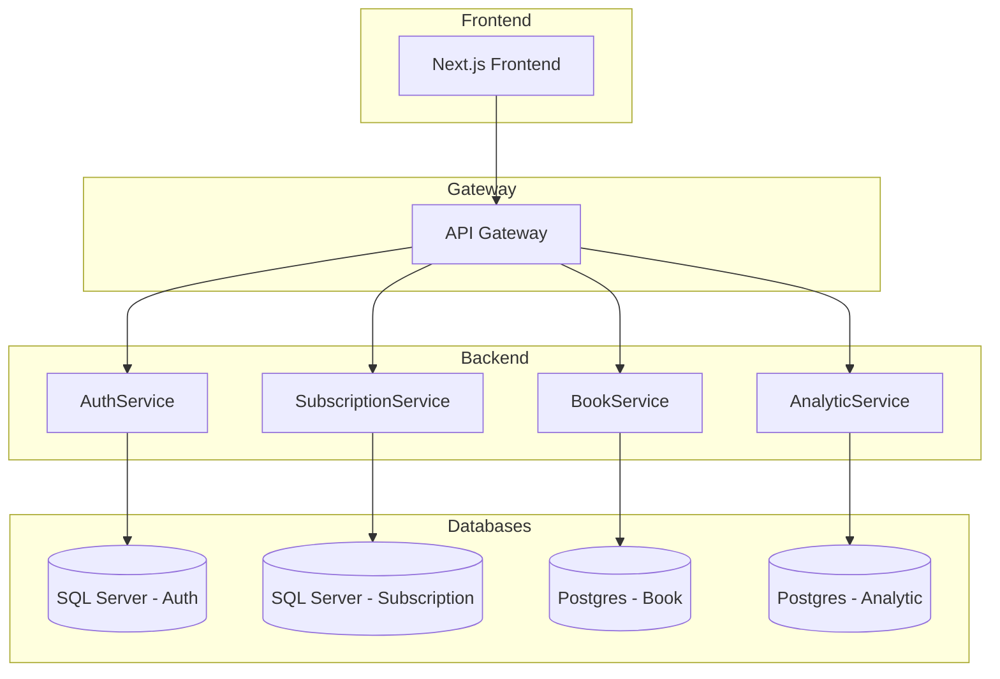

# TheKade Nalandaa

A microservices-based system built with **.NET backend** and **Next.js frontend**.

---

## Overview

- **Backend:** .NET microservices (Auth, Book, Subscription, Analytic)
- **Frontend:** Next.js (App Router, TypeScript)
- **Databases:** SQL Server & PostgreSQL
- **Other:** Redis, JWT Auth, Dockerized deployment

---

## Repository Structure

```
/backend    -> All microservices (.NET)
   /AuthService
   /BookService
   /SubscriptionService
   /AnalyticService
/frontend   -> Next.js app
/docs       -> Architecture, deployment, API docs
```

---

## 📘 Documentation

- [Backend Documentation](./backend/README.md)
- [Frontend Documentation](./frontend/README.md)
- [Architecture & System Design](./docs/ARCHITECTURE.md)
- [Deployment Guide](./docs/DEPLOYMENT.md)
- [API Guide](./docs/API_GUIDE.md)

---

## Architecture Diagram



### 1. Clone Repository

```bash
git clone https://github.com/NayanthaNethsara/TheKade-Nalandaa.git
Cd  TheKade-Nalandaa
```

## Quick Start (Local)

### Prerequisites

- **Node.js** 18.17+ and npm/yarn
- **.NET 9.0 SDK**
- **SQL Server** (LocalDB or server)
- **Docker**
- ## **Git**

### 1. Backend (Microservices)

1. Go to the backend folder:
   ```bash
   cd backend
   ```
2. Copy environment variables:

   ```bash
   cp .env.example .env
   ```

   Update `.env` with your local config if needed.

3. Start all backend services:
   ```bash
   docker-compose up --build
   ```
   - AuthService → http://localhost:5001
   - BookService → http://localhost:5002
   - SubscriptionService → http://localhost:5003
   - AnalyticService → http://localhost:5004
   - API Gateway → http://localhost:8000

### 2. Frontend (Next.js)

1. Go to the frontend folder:
   ```bash
   cd frontend
   ```
2. Install dependencies:
   ```bash
   npm install
   ```
3. Start development server:
   ```bash
   npm run dev
   ```
   Open → http://localhost:3000

---
