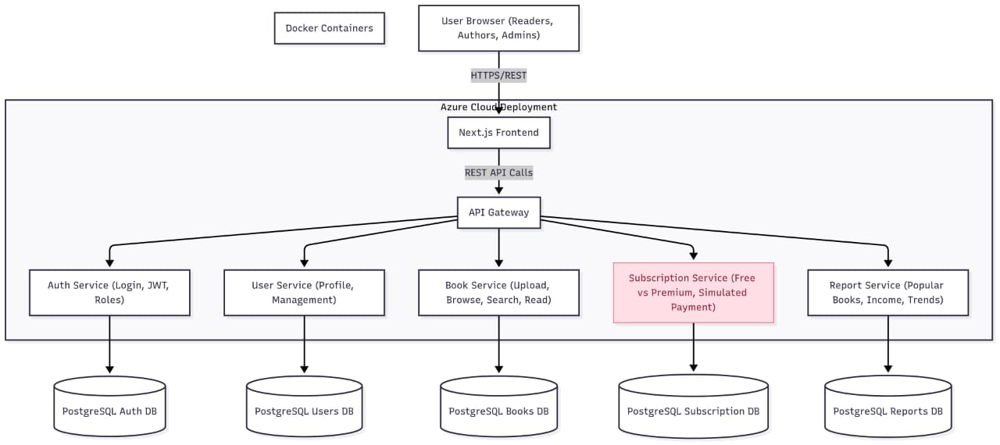
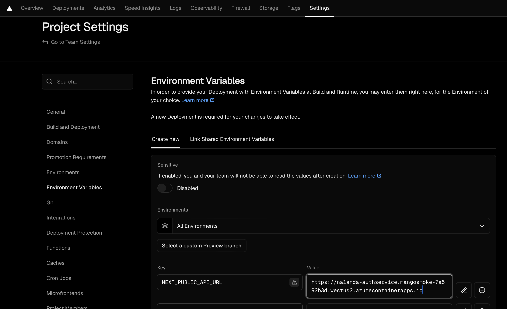

# 📚 Nalandaa - cloud-based eBook platform

A cloud-based eBook platform that enables authors to
publish books and readers to discover and read them online. The system provides a modern, subscription-style
model where free and premium readers can access digital content. Admins regulate uploaded books, users, and
system activity.


---
## Architecture Overview



---
## Tech Stack

### Frontend
- **Framework**: Next.js 15.5.2 with App Router
- **Core Library**: React 19.1.0
- **Language**: TypeScript 5.9.2
- **Styling**: Tailwind CSS 4.1.12 
- **UI Components**: Radix UI + Custom Components
- **Deployment**: Vercel 

### Backend Services
- **Runtime**: .NET 9.0
- **Framework**: ASP.NET Core 9.0
- **Database**: Azure SQL DB
- **ORM**: Entity Framework Core 9.0.8
- **Authentication**: JWT + Google OAuth 2.0
- **API Documentation**: Swagger
- **Containerization**: Docker
- **Deployment**: Azure Container Apps

---

### DevOps & Infrastructure
- **CI/CD**: GitHub Actions 
- **Container Registry**: GitHub Container Registry (GHCR)
- **Infrastructure**: Azure Container Apps 
- **Database**: Azure SQL DB
- **Frontend Hosting**: Vercel


---
## 📁 Project Structure

```

TheKade-Nalandaa/
├── README.md
├── .github/
│   └── workflows/
│       └── ci.yml
├── backend/
│   ├── docker-compose.yml
│   ├── AuthService/
|   |   ├── Configurations/
│   │   ├── Controllers/
│   │   ├── Models/
│   │   ├── DTOs/
│   │   ├── Helpers/
│   │   ├── Repositories/
│   │   ├── Properties
│   │   ├── Services/
│   │   ├── Data/
│   │   ├── Migrations/
│   │   └── Dockerfile
│   ├── AuthService.Tests/
│   └── BookService/
└── frontend/
    ├── package.json
    ├── app/
    ├── components/
    ├── lib/
    ├── Config/
    ├── Public/
    ├── hooks/
    └── types/

```

---

## Deployment Strategy


  ### Vercel Deployment (Frontend)
1. **Connect Repository**: Link GitHub repo to Vercel
2. **Environment Variables**: Set production environment variables
3. **Automatic Deployment**: Every push to `dev` triggers deployment
4. **Custom Domain**: Configure the domain in Vercel dashboard



  ### Azure Deployment (Backend)
1. **GitHub Secrets**: Configure Azure credentials
2. **Push to Dev**: GitHub Actions deploys AuthService, BookService
3. **Container Deployment**: Azure Container Apps
 
---

## Quick Start

### Prerequisites
- **Node.js** 18.17+ and npm/yarn
- **.NET 9.0 SDK**
- **SQL Server** (LocalDB or server)
- **Docker**  
- **Git**
 ---
## Acknowledgments

- **Microsoft** for .NET and Azure platform
- **Vercel** for Next.js hosting
- **Google** for OAuth services
- **GitHub** for Actions and Container Registry

---

 [Branching Strategy](docs/branching-strategy.md)

 
### 1. Clone Repository
```bash
git clone https://github.com/NayanthaNethsara/TheKade-Nalandaa.git
Cd  TheKade-Nalandaa
```
