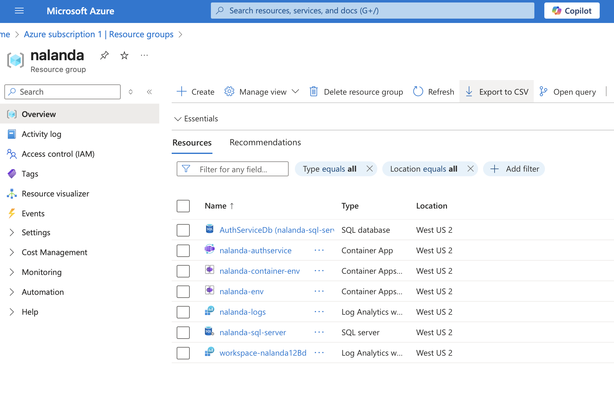

# Azure Infrastructure Deployment Guide

This guide covers setting up Azure infrastructure for the Nalandaa digital library platform  

## 📋 Prerequisites

1. Azure subscription 
2. GitHub repository 
3. Azure CLI 

## 🔐 Step 1: Create Azure Service Principal

Need to create a service principal for GitHub Actions to authenticate with Azure

### Option A: Using Azure Portal
1. Go to [Azure Portal](https://portal.azure.com)
2. Navigate to **Azure Active Directory** > **App registrations**
3. Click **New registration**
4. Name: `github-actions-nalanda`
5. Click **Register**
6. Note the **Application (client) ID** and **Directory (tenant) ID**
7. Go to **Certificates & secrets** > **New client secret**
8. Create a secret and copy the **Value**
9. Go to **Subscriptions** > Select your subscription
10. Go to **Access control (IAM)** > **Add role assignment**
11. Role: **Contributor**
12. Assign access to: **User, group, or service principal**
13. Select your app registration

### Option B: Using Azure CLI
```bash
# Login to Azure
az login

# Create service principal
az ad sp create-for-rbac \
  --name "github-actions-nalanda" \
  --role contributor \
  --scopes /subscriptions/74cf7098-471b-403e-bcf1-5b0445789eda \
  --sdk-auth

# This will output something like:
{
  "clientId": "xxxxxxxx-xxxx-xxxx-xxxx-xxxxxxxxxxxx",
  "clientSecret": "xxxxxxxxxxxxxxxxxxxxxxxxxxxxxxxxxx",
  "tenantId": "xxxxxxxx-xxxx-xxxx-xxxx-xxxxxxxxxxxx",
  "subscriptionId": "74cf7098-471b-403e-bcf1-xxxxxxxxxxxx"
}
```
---
## Step 2: Create Azure Resources
```bash
# Create resource group
az group create \
  --name thekade-rg \
  --location eastus

# Create SQL Server
az sql server create \
  --name thekade-sql-server \
  --resource-group thekade-rg \
  --location eastus \
  --admin-user nalandaadmin \
  --admin-password 'addpwd'

# Create database
az sql db create \
  --resource-group thekade-rg \
  --server thekade-sql-server \
  --name AuthServiceDB \
  --service-objective Basic

# Configure firewall
az sql server firewall-rule create \
  --resource-group thekade-rg \
  --server thekade-sql-server \
  --name AllowAzureServices \
  --start-ip-address 0.0.0.0 \
  --end-ip-address 0.0.0.0

# Create Container Apps environment
az containerapp env create \
  --name thekade-env \
  --resource-group thekade-rg \
  --location eastus
```

---

## Step 3: Configure GitHub Secrets

Go to your GitHub repository: 
`Settings > Secrets and variables > Actions > New repository secret`

Add these secrets:

| Secret | Value |
|--------|-------|
| `THEKADEAUTHSERVICE_AZURE_CLIENT_ID` | Client ID from service principal |
| `THEKADEAUTHSERVICE_AZURE_TENANT_ID` | Tenant ID from service principal |
| `THEKADEAUTHSERVICE_AZURE_SUBSCRIPTION_ID` | Subscription ID |
| `AZURE_RESOURCE_GROUP` | `thekade-rg` |
| `GHCR_PAT` | GitHub Personal Access Token |

### Creating GitHub Personal Access Token (GHCR_PAT)
1. Go to GitHub Settings > Developer settings > Personal access tokens
2. Generate new token (classic)
3. Select scopes: `write:packages`, `read:packages`
4. Copy the token and add as `GHCR_PAT` secret

---

##  Step 4: Deploy Infrastructure

### Automatic Deployment:
Push code to `dev` branch - GitHub Actions handles the rest.

### Manual Deployment:
1. Go to GitHub **Actions** tab
2. Select **"Build, Test & Deploy AuthService"** workflow
3. Click **"Run workflow"** → Select `dev` branch → **"Run workflow"**

 
 ---
 ## Resources Created

- **Resource Group** 
- **SQL Server** 
- **Database**
- **Container Environment**
- **Container App** 


 

Once the workflow completes, we'll get:

- **Container App URL**: `https://nalanda-authservice--xxx.westus2.azurecontainerapps.io`
  


 
 