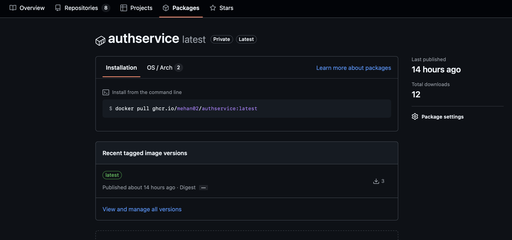

# CI/CD Pipeline Documentation

Complete guide to the continuous integration and deployment pipeline for the Nalandaa platform

## Pipeline Architecture


-----

## Branching Strategy

### Git Flow Implementation:
- **`main`** - Production branch  
- **`dev`** - Development branch
- **`feature/*`** - Feature branches (no automatic deployment)


### Backend CI/CD (`.github/workflows/ci.yml`)

---
## Pipeline Stages

### Stage 1: Source Control Triggers
 
 ---

### Stage 2: Build & Test
```yaml
Build Process:
├──  Checkout Code  
├──  Setup .NET 9.0 SDK
├──  Build Solution (Release Configuration)
└──  Run Unit Tests (xUnit)
```

### Stage 3: Containerization
```yaml
Docker Process:
├──  Login to GHCR (GitHub Container Registry)
├──  Setup Docker Buildx
├──  Build Docker Image
└──  Push to ghcr.io/nayanthanethsara/authservice:latest
```

### Stage 4: Deployment
```yaml
Azure Deployment:
├── Azure Login (Service Principal)
├── Update Container Image
└── Verify Deployment Status
```
---
## Security Configuration

### GitHub Secrets

| Secret | Purpose | 
|--------|---------| 
| `THEKADEAUTHSERVICE_AZURE_CLIENT_ID` | Service Principal ID |  
| `THEKADEAUTHSERVICE_AZURE_CLIENT_SECRET` | Service Principal Secret |  
| `THEKADEAUTHSERVICE_AZURE_TENANT_ID` | Azure Tenant ID |  
| `THEKADEAUTHSERVICE_AZURE_SUBSCRIPTION_ID` | Subscription ID |  
| `AZURE_RESOURCE_GROUP` | Resource Group Name | `thekade-rg` |
| `GHCR_PAT` | GitHub Package Token |  


---

### GitHub Token Scopes
```bash
# GHCR_PAT token permissions
write:packages               # Push container images
read:packages               # Pull container images
repo                        # Repository access  
```
---
##  Pipeline Monitoring

### Pipeline Logs Location:
### 1. **GitHub Actions**: Repository → Actions tab


### 2. **Container Registry**: GitHub → Packages → authservice

###

### 3. **Azure Deployment**: Azure Portal → Container App → Log stream
###


## Frontend (Vercel)

 ---
### Secret Management:
- Used GitHub secrets for sensitive data
- Never commited secrets to code
